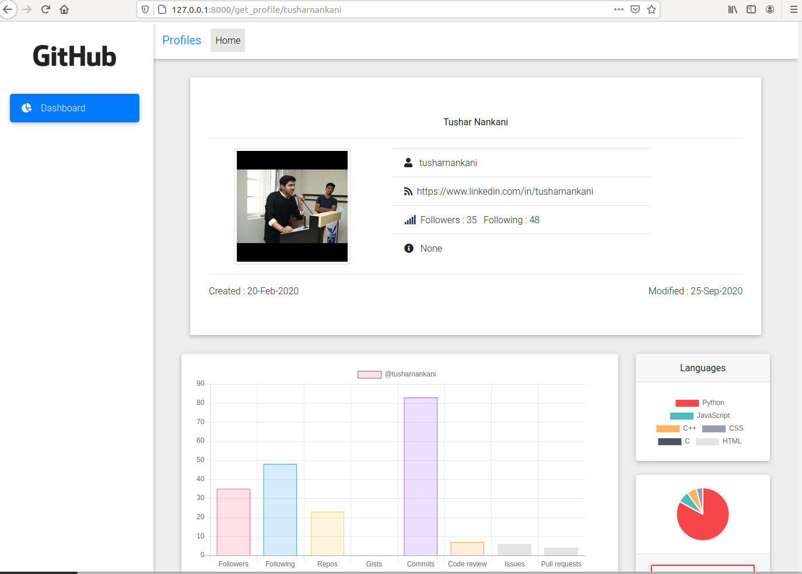
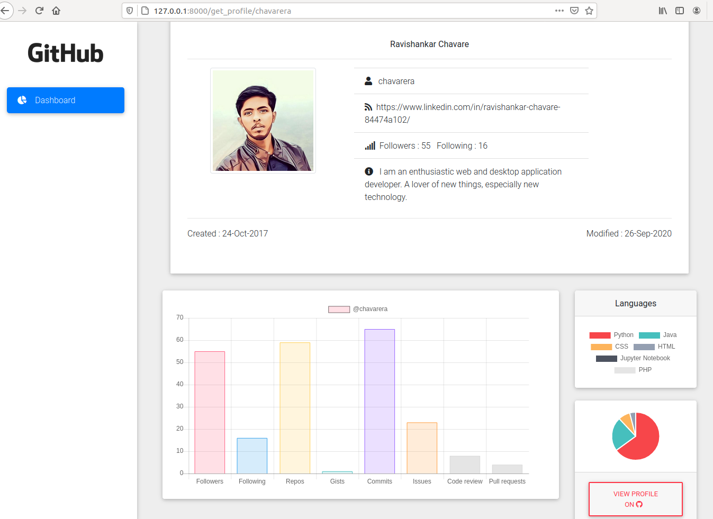
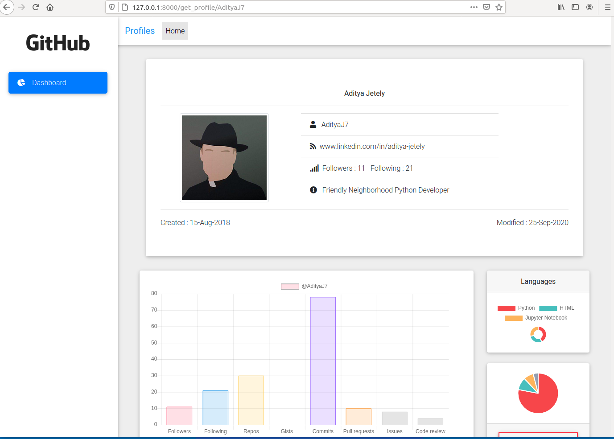

# GitProfile

This is a simple utility tool, this will analyze public git profile

## Demo App

visit [Here](https://guarded-depths-55025.herokuapp.com)

### Install

**Step 1.** Clone GitProfile Repository https://github.com/Python-World/GitProfile

```
 git clone https://github.com/Python-World/GitProfile
```

**Step 2.** Change Directory

```
 cd GitProfile/
```

**Step 3.** Install Required Packages

```
pip3 install -r requirements.txt
```

**Step 4.** Configure github Access Token
Follow steps from [Here](https://docs.github.com/en/free-pro-team@latest/github/authenticating-to-github/creating-a-personal-access-token) to get github access token

once you get github access token in `config.ini`

```
github_token:<AccessToken>
```

**Step 5.** Now run the program by following command in any operating system of your choice :

```
pip install -r requirements.txt
```

## Demo

<details>
  <summary>1)@tusharnankani</summary>
 


</details>
<details>
  <summary>2)@chavarera</summary>
 

</details>
<details>
  <summary>3)@AdityaJ7</summary>
 

</details>

## Suppport

If you facing any issue while executing create a issue [Here](https://github.com/Python-World/GitProfile/issues) and upload your problem with detailed description

## Contribution

We welcome contributions from everyone. Here are the guidelines if you are thinking of helping us:

Contributions should be made in the form of GitHub pull requests. Each pull request will be reviewed by someone with permission to land patches and either landed in the main tree or given feedback for changes that would be required. All contributions should follow this format.

Should you wish to work on an issue, please claim it first by commenting on the GitHub issue that you want to work on it. This is to prevent duplicated efforts from contributors on the same issue.

Look for good first issues to find good tasks to start with.
Your contributions are always welcome and appreciated. Following are the things you can do to contribute to this project.

1.  **Report a bug** <br>
    If you think you have encountered a new issue, and I should know about it, feel free to report it and I will take care of it.

2.  **Create a pull request** <br>
    It cannot get better then this, your pull request will be appreciated by the community. You can get started by picking up any open issues and make a pull request.

> If you are new to open-source, make sure to check read more about it [here](https://www.digitalocean.com/community/tutorial_series/an-introduction-to-open-source) and learn more about creating a pull request [here](https://www.digitalocean.com/community/tutorials/how-to-create-a-pull-request-on-github).

### 🌵Branches

-   No other permanent branches should be created in the main repository, you can create feature branches but they should get merged with the master.
